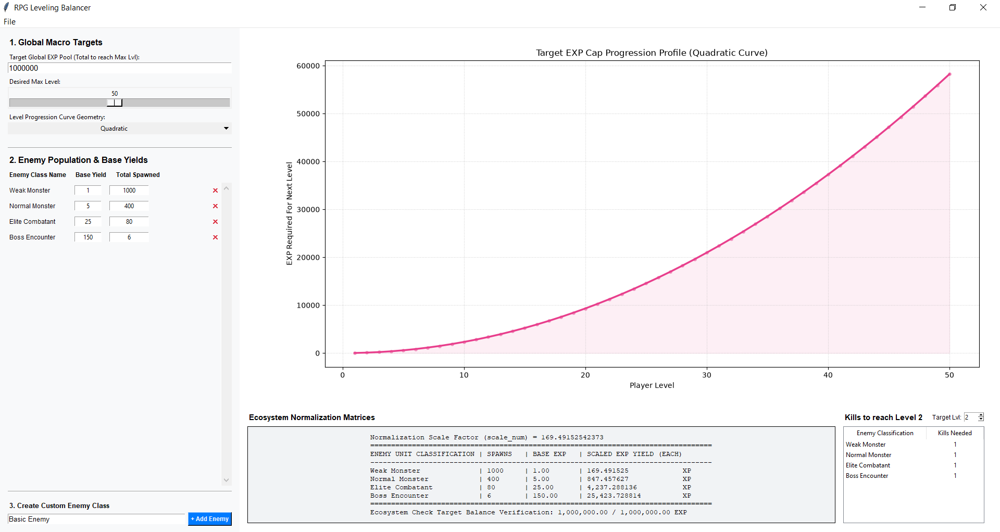

<div align="center">
  

  # RPG Leveling Balancer
  
  **An interactive, engine-agnostic desktop tool for balancing RPG progression curves against world population metrics.**

  [](https://www.python.org/)
  [](https://docs.python.org/3/library/tkinter.html)
  [](https://matplotlib.org/)
  [](https://numpy.org/)
  [](LICENSE)
</div>

---

<div align="center">
  
</div>

## Overview
The **RPG Leveling Balancer** is a desktop application built in Python using Tkinter and Matplotlib. It assists game designers in determining total enemy encounters, base XP yields, and pacing curves for turn-based RPGs. 

Instead of forcing you to tweak raw numbers trial-by-trial, this tool allows you to balance global player progression curves against macro world ecosystem distributions automatically.

---

## Key Features
* **Dynamic Archetype Allocation:** Add, modify, or remove custom monster or encounter classes on the fly with live UI recalculations.
* **Natural Ratio Scaling:** Uses a pure scaling equation (`scale_num = target_sum / current_sum`) to map designer-intended base weights directly to hard game progression targets.
* **Interactive Visualization:** Live plotting of **Linear**, **Quadratic**, and **Cubic** progression curves with interactive cursor anchor tracking.
* **Pacing Analytics:** Select any target level (e.g., Level 2) to view exact kill counts required per enemy class instantly.
* **Workspace Persistence & Data Export:** 
  * Import and export `.json` workspace state files.
  * Export normalized engine matrices directly to `.csv` for game engine integration (Unity, Unreal, Godot).

---

## Installation & Quickstart

### Option A: Pre-built Executable (Recommended for Game Designers)
1. Head over to the **[Releases](../../releases)** page.
2. Download the latest `.zip` package for Windows.
3. Extract and run `levelingbalancer.exe` (no Python installation required).

### Option B: Run from Source (For Developers)
1. **Clone the repository:**
   ```bash
   git clone https://github.com/YourUsername/RPG-Leveling-Balancer.git
   
2. **Launch the application:**
   ```bash
   python levelingbalancer.py

## The Math Engine
Instead of utilizing abstract weights, this application uses **real population counts** to handle normalization calculations.

You design the base feel of an encounter (for example, a Rat yields `1 XP`, a Boss yields `150 XP`), specify how many exist across the map layout, and the engine stretches or shrinks those values down to 11 decimal places to align perfectly with your macro target level cap pool.
